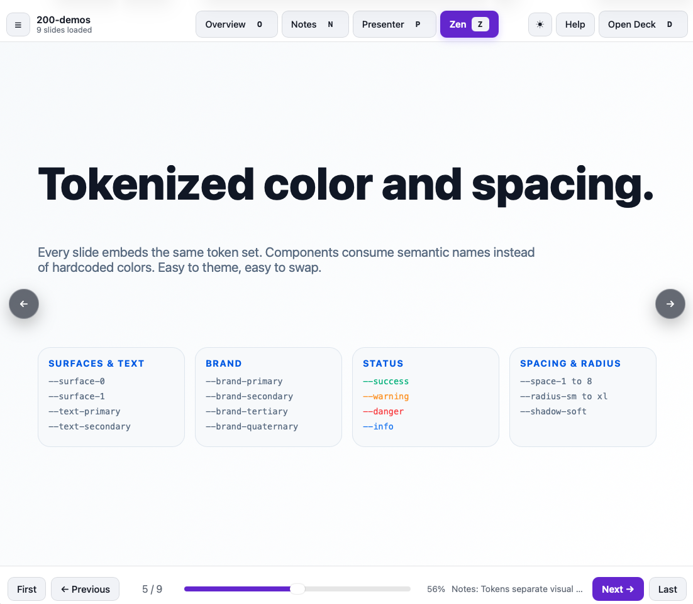

# Slide Deck Viewer

**Transform HTML slides into a polished presentation.** No servers. No build steps. No dependencies.

AI agents make it easy to generate presentations as standalone HTML files. But once you have a folder full of slides, you need a way to present them: navigation, speaker notes, fullscreen mode, overview grid, and keyboard shortcuts.

That's what this viewer does. Open `100-viewer.html` in your browser, pick a folder of HTML slides, and present.

## See It In Action

### Landing Page

The clean interface greets you with a simple folder picker—no config files, no fuss.



### Presentation View

Navigate with buttons, keyboard shortcuts, or click the edges. The sidebar shows all slides. Progress bar at the bottom.


### Overview Grid

Press `O` to see all slides at once. Click any slide to jump to it.


### Speaker Notes

Press `N` to show notes beside your slides, or `P` to open a presenter window with notes and timer.


## Get Started In 30 Seconds

1. Open `100-viewer.html` in any modern browser (Chrome, Edge, Safari, Brave).
2. Click **Choose Folder** and select your HTML slide files.
3. Click **Next** or press arrow keys to navigate.
4. Press `N` to see speaker notes, or `P` for a separate presenter window.

**No server. No installation. Works offline.**

## What You Get

| Feature              | What It Does                                         |
| -------------------- | ---------------------------------------------------- |
| **Folder picker**    | Choose local files without editing config            |
| **Smart sorting**    | `slide2.html` appears before `slide10.html`          |
| **Visible nav**      | Click edges, buttons, arrow keys, spacebar, or swipe |
| **Slide sidebar**    | Jump to any slide by title                           |
| **Overview grid**    | Scan all slides and jump instantly                   |
| **Zen fullscreen**   | Hide all chrome for audience view                    |
| **Speaker notes**    | Private talking points beside your slides            |
| **Presenter window** | Second monitor with notes and timer                  |
| **Theme toggle**     | Dark or light mode                                   |
| **Deep links**       | URL remembers your current slide                     |
| **Offline mode**     | Works completely without internet                    |

## When to Use This

Use the viewer when you:

- Ask an AI agent to generate a presentation as HTML files
- Need to review or present generated slides immediately
- Want full HTML/CSS control without rigid slide templates
- Must keep sensitive material local and offline
- Prefer a portable viewer that travels with your deck
- Want presentation controls without adopting a full framework

## Keyboard Shortcuts

| Action           | Keys           |
| ---------------- | -------------- |
| Next slide       | `→` or `Space` |
| Previous slide   | `←`            |
| First slide      | `Home`         |
| Last slide       | `End`          |
| Zen (fullscreen) | `Z` or `F`     |
| Overview grid    | `O`            |
| Speaker notes    | `N`            |
| Presenter window | `P`            |
| Slide list       | `L`            |
| Theme toggle     | `M`            |
| Open deck        | `D`            |
| Help             | `H` or `?`     |
| Close/Exit       | `Esc`          |

On touch devices, swipe left and right to navigate.

## Build Your Slides

Each slide is a standalone HTML file. Use whatever HTML, CSS, and JavaScript you need.

**Minimal slide example:**

```html
<!DOCTYPE html>
<html lang="en">
  <head>
    <meta charset="utf-8" />
    <meta
      name="viewport"
      content="width=device-width, initial-scale=1" />
    <title>My Slide</title>
    <style>
      body {
        display: grid;
        place-items: center;
        height: 100%;
        font-family: system-ui;
      }
    </style>
  </head>
  <body>
    <main>
      <h1>Project Update</h1>
      <p>What changed, what shipped, what's next.</p>
    </main>

    <aside class="notes">Mention the customer feedback here.</aside>
  </body>
</html>
```

**Key points:**

- Each file is a complete, standalone HTML document
- The viewer loads each slide in an isolated iframe
- Slides don't interfere with each other
- Use `<title>` for the slide list label (falls back to first heading or filename)
- Add `<aside class="notes">` for speaker notes (hidden until you press `N`)

**File naming matters:** The viewer sorts slides naturally, so `slide02.html` appears before `slide10.html`.

## Slide Templates

The `300-templates/` folder contains ready-to-use starting points:

| Template         | Description                                        |
| ---------------- | -------------------------------------------------- |
| `100-basic.html` | Minimal starter — copy and customise               |
| `200-light/`     | 25 light-theme layouts with varied colour palettes |
| `300-dark/`      | 25 dark-theme layouts with varied colour palettes  |

Templates cover 25 distinct layout patterns including: classic title, title+body with divider, split diagram+text, image focus, three columns, big quote, stats/numbers, section header, agenda, two-column comparison, horizontal timeline, code snippet, image+text overlay, 2×2 grid cards, consulting style, bold statement, data table, horizontal band split, accent sidebar, pastel gradient, diagonal split, top accent band, minimal typography, visual pyramid, and full-bleed solid colour.

To start a new slide, copy `100-basic.html`, rename it following your deck's numbering scheme, and adapt the content and styles.

## Advanced Features

### Speaker Notes

Add private notes to any slide:

```html
<aside class="notes">Key talking points only you see.</aside>
```

- Press `N` to show notes in a docked sidebar
- Press `P` to open a separate presenter window with notes and a timer
- Notes are never shown in the main slide view

### Presenter Mode

Open a second window with:

- Speaker notes for the current slide
- Countdown timer
- Slide navigator
- Perfect for displaying slides on a projector while you present on another monitor

### Theme Toggle

Switch between dark and light themes with the **Theme** button or press `M`. Your preference is saved in browser storage.

## Browser Support

| Browser | Status                                          |
| ------- | ----------------------------------------------- |
| Chrome  | ✅ Full support                                 |
| Edge    | ✅ Full support                                 |
| Safari  | ✅ Full support                                 |
| Brave   | ✅ Full support                                 |
| Firefox | ⚠️ Use "Choose Files" instead of folder picking |

The viewer uses browser-native file APIs. If folder picking doesn't work, use **Choose Files** to select individual slides.

## Privacy & Offline

- **Your slides stay local.** Nothing is uploaded.
- **Works offline.** No internet required after opening the file.
- **Browser storage only.** Lightweight preferences (theme, last slide number) are stored locally.
- **Temporary access.** When you close the tab, access to your files is revoked.

## Why Not Just Use…

| Tool                 | Why This Is Different                                   |
| -------------------- | ------------------------------------------------------- |
| PowerPoint / Keynote | This gives you code-level HTML/CSS control              |
| Google Slides        | This works offline and keeps your slides local          |
| Reveal.js / Remark   | This needs no build step or dependencies                |
| PDF export           | This is a live presentation tool, not a document format |

## Development & Maintenance

See [`AGENTS.md`](AGENTS.md) for development guidelines and future-proofing rules.

**Core principle:** Users should never need Python, Node, npm, a server, build tools, CDN scripts, or external dependencies to present.

If you modify the viewer, please update this README and keep `AGENTS.md` accurate.

## Why The Folder Picker?

Browsers don't let static HTML files scan arbitrary folders by path—that's a security feature. The folder picker is the browser-approved way for _you_ to grant access to your local files. This is why the viewer asks you to choose a folder instead of hardcoding a path.

## What This Is

- ✅ A lightweight presentation viewer for HTML slide files
- ✅ Works offline, completely local-first
- ✅ No dependencies, no build steps
- ✅ Perfect for AI-generated presentations
- ✅ Full HTML/CSS/JS freedom per slide

## What This Isn't

- ❌ A slide authoring tool
- ❌ A markdown-to-slides converter
- ❌ A PDF exporter
- ❌ A collaborative editor
- ❌ A web app that requires a server
- ❌ A tool that uploads your content
